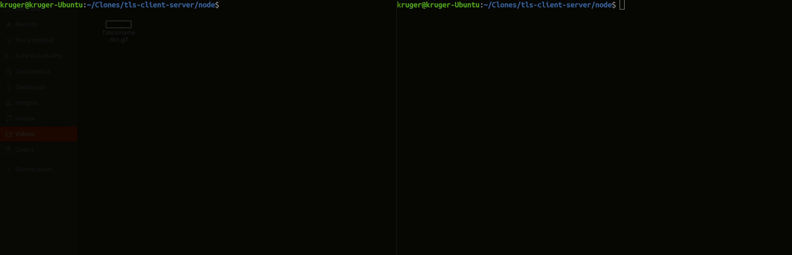
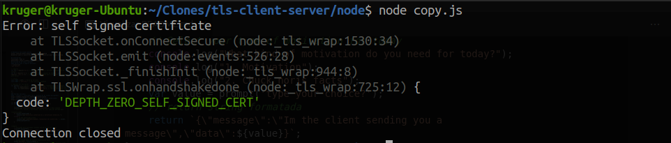
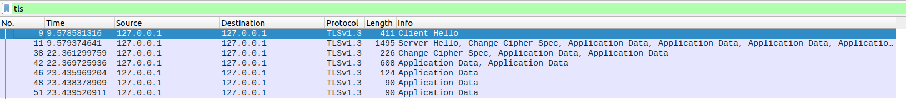
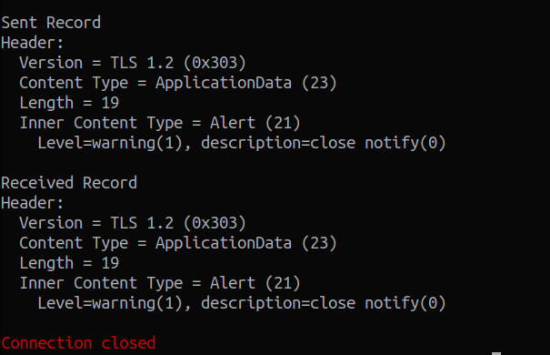
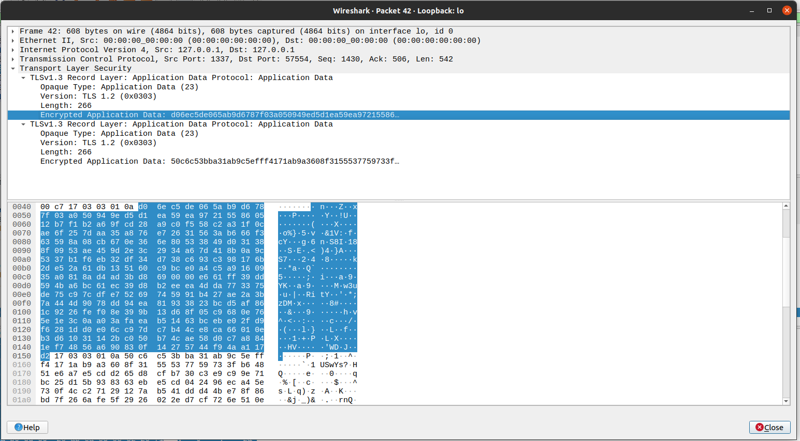
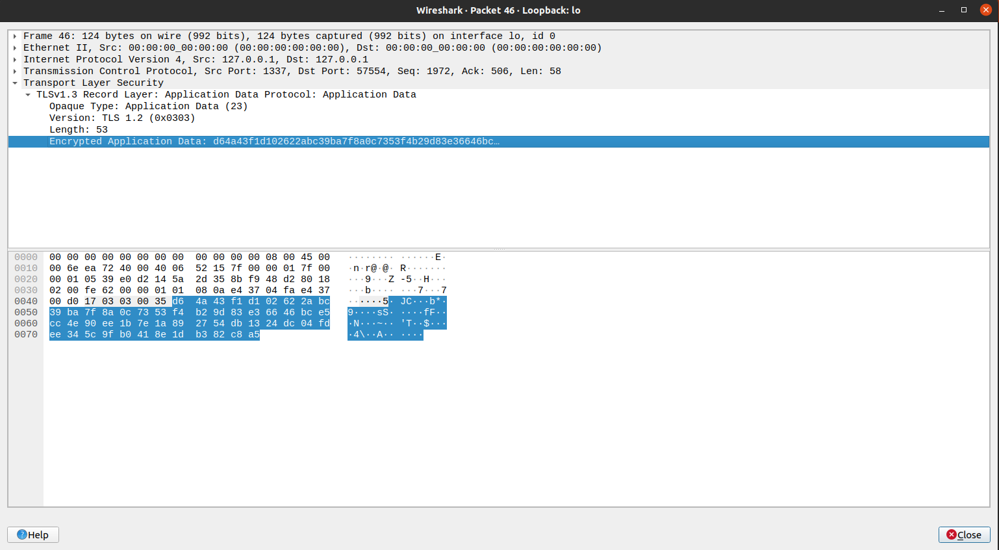

# Relatório TLS Client Server
Aluno: Leonardo Bueno Nogueira Kruger GRR: 20180130
Relatório sobre a construção de um sistema cliente/servidor seguro com TLS. 

## Informações
Tecnologia: Node js
Biblioteca: https://nodejs.org/api/tls.html
## Elucidação de todo o projeto 
#### Declarações e imports Servidor:
~~~javascript
'use strict';

// Imports
var tls = require('tls'); // Biblioteca TLS para o servidor e manupulação de sockets
var fs = require('fs'); // Biblioteca FS para acessar os arquivos .pem
require('./api.js')(); // Arquivo js foi utilizado para criar dados de resposta para enviar

// Consts
const PORT = 1337; // Porta do servidor
const HOST = '127.0.0.1' // host servidor loopback

// Options for tls server
var options = { // option é utilizado nas funções createServer e tls.connect
    key: fs.readFileSync('../pem/private-key.pem'), // caminho para private key
    cert: fs.readFileSync('../pem/public-cert.pem'), // caminho para public cert
    
};
~~~
## Funções servidor:
#### - **Sigilo é confirmado com a verificação de socket.encrypted**
https://nodejs.org/api/tls.html#tlssocketencrypted
#### - **Autenticidade é confirmado atraves de socket.authorized** 
https://nodejs.org/api/tls.html#tlssocketauthorized

~~~ javascript
var server = tls.createServer(options, function(socket) {

    // socket.enableTrace();
    console.log('\x1b[31m%s\x1b[0m',"NEW CONNECTION"); // Nova conexão
    // Checa se a conesão é autorizada, caso não seja pode ser barrada aqui
    
//Autenticidade    
    if (socket.authorized) { 
        console.log("Connection authorized by a Certificate Authority.");
    } else {
        // Se não autorizada printa 
        console.log('\x1b[36m%s\x1b[0m',"Connection not authorized: ", socket.authorizationError)
    }

    
//Sigilo
    // Utilizado para distinguir Sockets TLS de Socket net padrão
    if(socket.encrypted){
        console.log('\x1b[36m%s\x1b[0m',"This is a encrypted TLS Socket instance");
    }else{
        console.log('\x1b[36m%s\x1b[0m',"This is a regular net.Socket instance");
    }

    // Quando recebe dados do sockets (application data)
    socket.on('data', function(data) {
        try { // Se no formato e valores especificados gera uma resposta vinda do 'api.js'
            var x = JSON.parse(data.toString());
            if(x.data == 1){
                motivation()
                    .then(data => {
                        socket.write(data);
                    })
                    .catch(err => console.log(err))
            }else if(x.data == 2){
                quote()
                    .then(data => {
                        socket.write(data.value);
                    })
                    .catch(err => console.log(err))
            }else{
                socket.write("Selected option is invalid");    
            }    
        } catch (error) {
            socket.write("Error generating a response");
        }
        
        // Printa os dados recebidos do cliente.
        console.log('Received: %s [it is %d bytes long]',
            data.toString().replace(/(\n)/gm,""),
            data.length);

    });
    // Printa EOT quando a conexão é fechada
    socket.on('end', function() {
        console.log('\x1b[31m%s\x1b[0m','EOT (End Of Transmission)\n');
    });

});
~~~
### Start server e erro:
~~~ javascript
// Server escutando no endereço e portas especificados.
server.listen(PORT, HOST, function() {
    console.log("I'm listening at %s, on port %s", HOST, PORT);
});

// Handler para quando ocorre erros no servidor
server.on('error', function(error) {
    console.error(error);
    // Fecha conexão em caso de erro
    server.destroy();
});

~~~

## Declarações e imports CLiente:
#### - **Importante ressaltar a necessidade de: "rejectUnauthorized: false" em options, caso contrario a bibliteca TLS acusa erro de autorização 'DEPTH_ZERO_SELF_SIGNED_CERT' que está correto pois os certificado que geramos para o projeto são assinados por nos e não por um organização confiavel.**
~~~ javascript
'use strict';

// Imports
var tls = require('tls'); // Biblioteca TLS para o servidor e manupulação de sockets
var fs = require('fs'); // Biblioteca FS para acessar os arquivos .pem
const { exit } = require('process');
const prompt = require('prompt-sync')({sigint: true}); // Para leitura de input teclado

// Consts
const PORT = 1337; // Porta do servidor
const HOST = '127.0.0.1' // host servidor loopback

// Options for tls server
var options = { // option é utilizado nas funções createServer e tls.connect
    key: fs.readFileSync('../pem/private-key.pem'), // caminho para private key
    cert: fs.readFileSync('../pem/public-cert.pem'), // caminho para public cert
    rejectUnauthorized: false // Importante para que o cliente funcione, caso contrario socket reclama de SELF_SIGNED_CERTIFICATE
    
};
~~~
## Funções Cliente:
~~~ javascript
var client = tls.connect(PORT, HOST, options, function() {
    
    // client.enableTrace();
    // Print para inicio de conexão com o servidor
    console.log('\x1b[36m%s\x1b[0m',`START CONNECTION AT ${HOST}, ON PORT ${PORT}`);

    //Checa se está tudo certo com nossa autorização e printa informação
    if (client.authorized) {
        console.log("Connection authorized by a Certificate Authority.");
    } else {
        console.log('\x1b[36m%s\x1b[0m',"Connection not authorized: " + client.authorizationError)
    }
    
    // Função para criar a str de envio ao servidor
    var str = makeString();
    
    // Envia a str para o servidor
    client.write(str);        

});

// Handler para recebimento de dados
client.on("data", function(data) {
    // Printa os dados recebidos e encerra a conexão
    console.log('\x1b[36m%s\x1b[0m','\nReceived: ' );
    console.log( data.toString().replace(/(\n)/gm,""));
    console.log('\x1b[36m%s\x1b[0m',`[it is ${data.length} bytes long]\n`);
    client.end();

});

// Handler para fechamento de conexão e print para log
client.on('close', function() {
    console.log('\x1b[31m%s\x1b[0m',"Connection closed");
    exit();
});

// Handler para erro e print para log
client.on('error', function(error) {

    console.error(error);
    
    // Close the connection after the error occurred.
    client.destroy();
});

// Cria uma string JSON com os dados para o servidor 
function makeString(){
    // Select your type of motivation for today
    console.log("What kind of motivation do you need for today?");
    console.log("1. Motivation");
    console.log("2. Chuck noris facts");
    var value = prompt('type your choice?');
    // return string formatada
    return `{\"message\":\"Im the client sending you a message\",\"data\":${value}}`;
}

~~~

## Funcionamento
#### Ressaltando que mesmo após a configuração a conexão funciona porém é tido como não autorizada devido ao certificado não ser assinado por uma organização certificada. E o servidor pode barrar esse tipo de conexão nos testes realizados com [socket.authorized](#funções-servidor) e [socket.encrypted](#funções-servidor), demonstrando Sigilo e Autenticidade.
- Inicializamos o servidor
- Ao executar o clinte é iniciada a conexão com client hello e server hello, usuario escolhe a opção de informação a receber;
- Então é enviada e estabelecida a conexão com o servidor;
- Ocorrem as verificações do socket recebido;
- Servidor gera e envia a resposta;
- Cliente ao receber a resposta, printa e encerra a coneçxão.

## Execução do cliente sem "rejectUnauthorized: false", demonstra que precisa de um certificado valido para projetos reais.

## Captura dos pacotes 
- Wireshark

- Da imagem, os pacotes de uma execução do projeto podemos ver claramente as etapas.
- Client Hello;
- Server Hello;
- Estabelece Cipher;
- Conexão estabelecida, para troca de dados;
- Application [data enviada criptografada](#dados-encriptados) do cliente para servidor;
- Application [data enviada criptografada](#dados-encriptados) em resposta ao cliente, do servidor para o cliente;
- Ao finalizar a conexão é comunicado através dos dois ultimos pacotes( 1 cliente, 1 servidor) application data vistos na imagem.

#### Atraves do [socket.enableTrace()](https://nodejs.org/api/tls.html#tlssocketenabletrace) podemos constatar o mesmo sobre a comunicação.

## Dados encriptados

 
